[Main Page](../../README.md)

# Wifi Password Recovery

First we need to capture some handshakes.
- Under Wifi Atks pick Target Atks

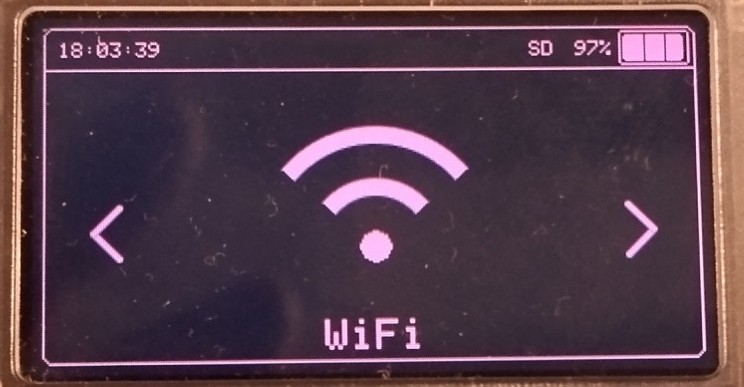
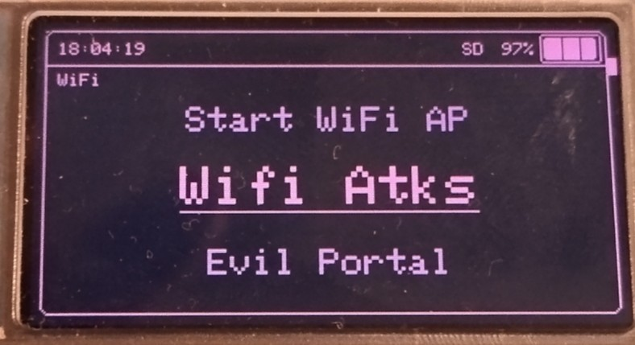
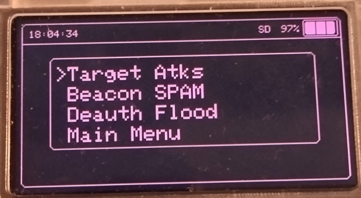
- Choose SSID

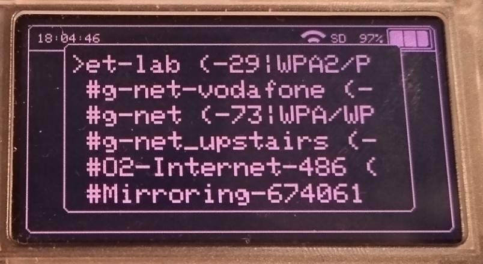
- Capture Handshake and wait

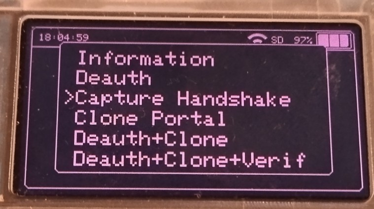
- You can press Mid button to deauth which will force client to reconnect and you got handshake.

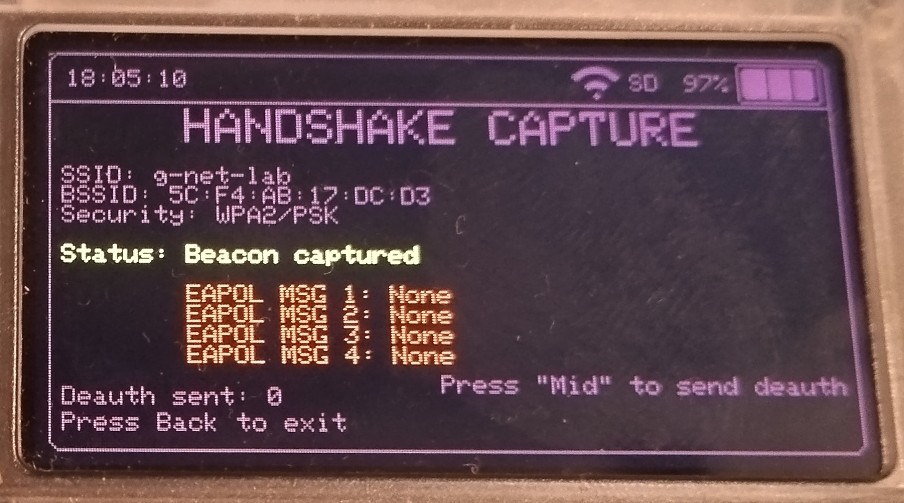
- And eventually ...

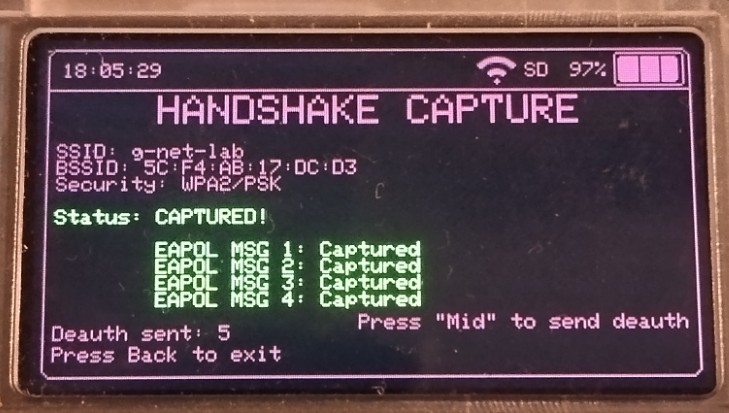

Once we have captured the packets we need we can try recover it using wordlist.
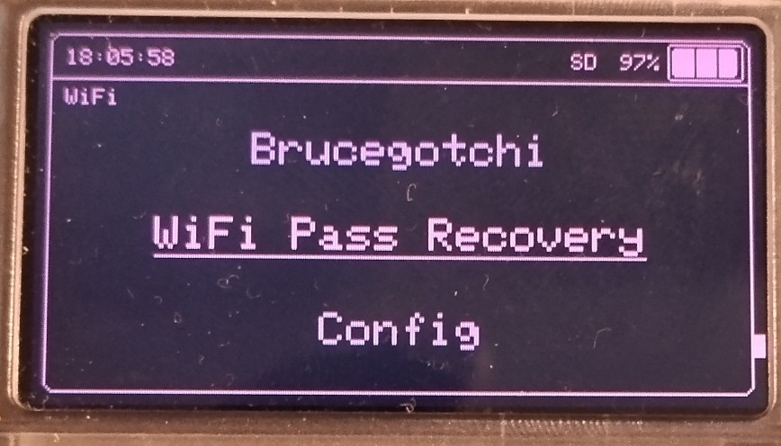
- Pick the wordlist
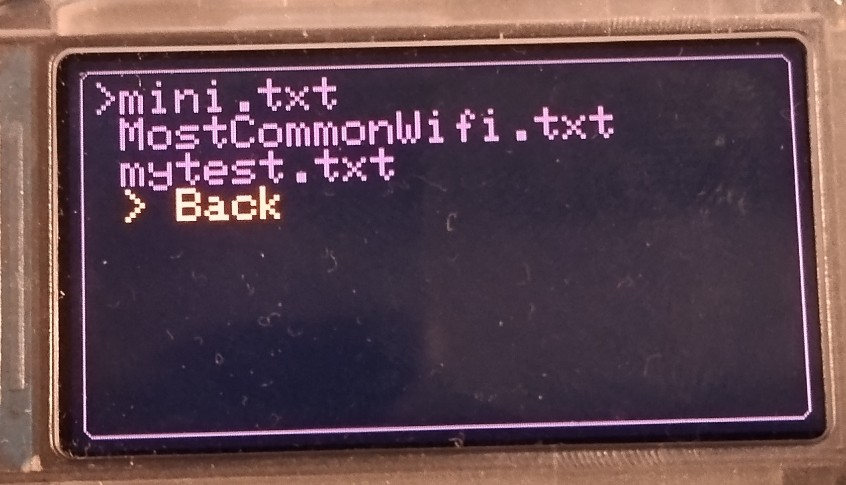
- Then the pcap file with hanshake we captured previously
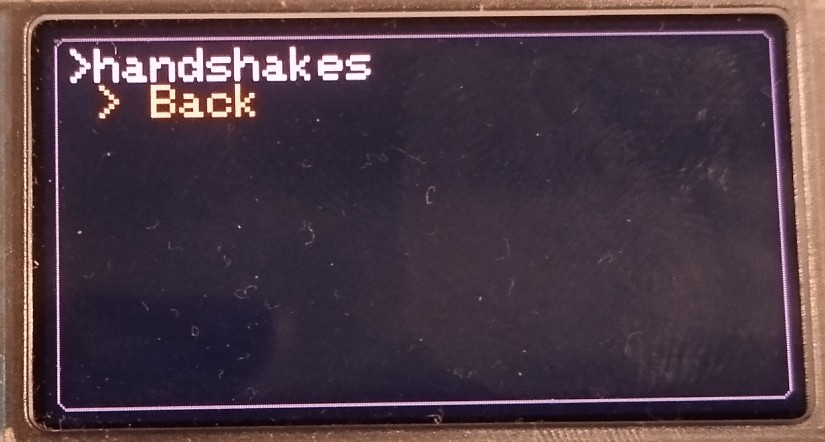
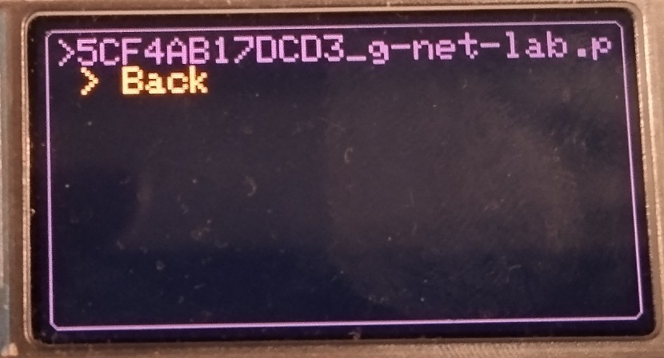
- Pick the SSID
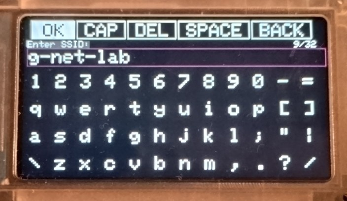
- Wait and pray
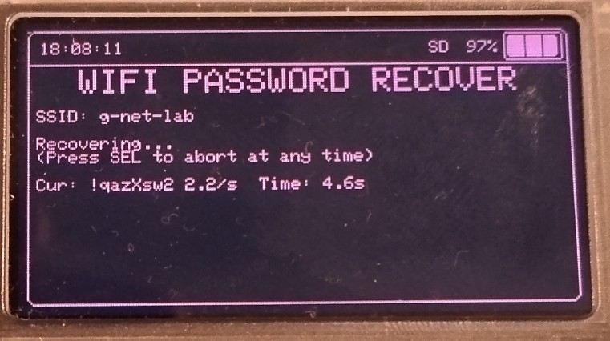
- And if you lucky enough, or admin is lazy ...
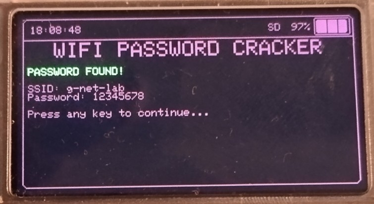

[Main Page](../../README.md)