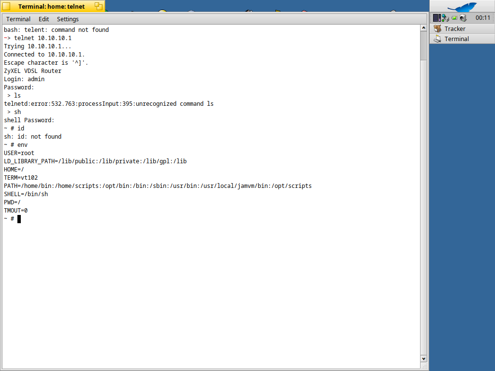

Those are notes from my "hacking" off Zyxel VMG1312-B30B

I have the admin password so it will not cover the way to get it.

By doing the [portscan](OpenPorts.md) and openning the device there are two ways in:
- Telnet
- [UART](UART.md)

As we know the user is admin and we got the password we can start obtaining info:
- [Versions](Versions.md)
- [Hardware info](HWInfo.md)
- [Boot output from UART](BootOutput.md)
- [Available Commands](CommandsOfficial.md)

As we have avalable just limit set of commands, but we know there is BusyBox our goal is to get full shell.
From the list of commands it doesn't seem there is some direct way, but there is **echo**
As you might know echo will print the variables so let's see:
```
 > echo $PATH
/home/bin:/home/scripts:/opt/bin:/bin:/sbin:/usr/bin:/usr/local/jamvm/bin:/opt/scripts
```
So now we have some idea it would be cool if we can do **ls** but that is not possible it is not in available commands not even if you try it regardless
Now what? Shell substitution will do? YES
```
 > echo $(ls /usr/sbin)
brctl chpasswd dnsd fakeidentd flash_eraseall httpd inetd lpd telnetd udhcpd
```
Cool using this technic we can possibly run any command and got it's output but what commands we can run Unofficially?
Well combinin the $PATH and know linux directories with command's we can do:
- ls /bin
- ls /sbin
- ls /usr/bin
- ls /usr/sbin

Here you can find full list of [Unofficial commands](RunningCommandsIndirectly.md)
OK the problem is that even though there is sh and bash running is subshell will not help. 
So we need to somehow edit the boot sequence to get maybe editing /etc/init.d/rcS would to and yes we can use:
```
echo $(echo "Hello world" >> /tmp/test.txt)
```
But rootfs seems not to be writtable, there is no overlay and no sync so bad luck.
Let's see if we can do something to get full shell at least temporarly for now. So let's inspect the commands we have once more.
And see some options:
- openssl and nc are there but they are limited so I wasn't able to set revers shell
- telnetd is not letting me bind the program
- cttyhack that cathes attention doesn't it?

What does **cttyhack** do?
```
 > echo $(cttyhack )
BusyBox v1.17.2 (2015-03-17 17:51:42 CST) multi-call binary.

Usage: cttyhack PROG ARGS

Give PROG a controlling tty if possible.
Example for /etc/inittab (for busybox init):
        ::respawn:/bin/cttyhack /bin/sh
Giving controlling tty to shell running with PID 1:
        $ exec cttyhack sh
Starting interactive shell from boot shell script:
        setsid cttyhack sh

```

Well it actually do this but you don't need to know the tty's
```
exec sh </dev/ttyS0 > /dev/ttyS0 2>&1
```

***Starting interactive shell from boot shell script*** yes so now how to add something to startup?
Well in [Available Commands](CommandsOfficial.md) is **autoexec** that could be the way, let's see:

```
 > autoexec add setsid cctyhack sh
[setsid cctyhack sh]
setsid: can't execute 'cctyhack': No such file or directory
 autoexec add '/bin/setsid /bin/cctyhack /bin/sh'
['/usr/bin/setsid /bin/cctyhack /bin/sh']
sh: /usr/bin/setsid /bin/cctyhack /bin/sh: not found
 > autoexec add 'echo "g33k p0wns you"'
['echo "g33k p0wns you"']
sh: echo "g33k p0wns you": not found
```

Hmm that doesn't look good. But what happens when I just run it in subshell?
```
 > echo $(setsid cctyhack sh)
~ # ls
bin         etc         linuxrc     proc        tmp         vmlinux.lz
data        firmware    mnt         sbin        usr         webs
dev         lib         opt         sys         var
```
Huray, or maybe not after few minutes you got error and the shell behave messy.
```
 consoled:error:134.356:prctl_runCommandInShellWithTimeout:174:prctl_collect failed, ret=9809
```

OK so I will probably need to get firmware and somehow edit it and flash it in. Because, I cannot run commands which are not offical unless I do with shell substitution, I know, I tried ls and it didn't work.
OK just for fun let me try sh

```
 > sh
shell Password: 
Incorrect! Try again.
shell Password: 
~ # ls
bin         etc         linuxrc     proc        tmp         vmlinux.lz
data        firmware    mnt         sbin        usr         webs
dev         lib         opt         sys         var
~ #

```

YES so easy. I first tried the password which I used for admin, but it didn't work. So was about to try: admin, 1234, admin1234, root, toor ... you know
admin it was.
And just like that I got full shell
